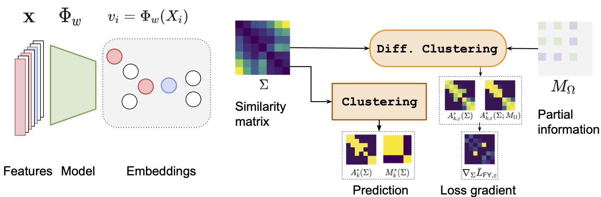

## Differentiable Clustering with Perturbed Random Forests

Contains the code to reproduce the experiments of:

**Differentiable Clustering with Perturbed Random Forests**, *Advances in Neural Information Processing Systems 2023.*
Authors of paper: Lawrence Stewart (Ecole Normale Superieure and INRIA), Francis Bach (Ecole Normale Superieure and INRIA), Felipe Llinares-Lopez (Google DeepMind), Quentin Berthet (Google DeepMind).
Authors of code: Lawrence Stewart.

<!--  -->



[Link to paper on ArXiV](https://arxiv.org/abs/2305.16358)

#### Licence:
This code is distributed under a Apache 2.0 licence.

#### Contents:

In the `src` repository one has access to:

- `clustercomparison.py`: generates a grid of figures displaying the toy-clustering data sets and methods.
- `_fullysup.py`: trains a model using the differentiable clustering frame work in the fully supervised setting. The prefix `cifar` corresponds to the **CIFAR-10** data set (the backbone is ResNet50) and the prefix `nist` corresponds to the **MNIST** and **Fashion MNIST** data sets (the backbone is LeNet5).
- `_fullsup_baseline` : same as above, but trains the baseline model using the cross-entropy loss.
- `_semisup.py` : same as ``_fullysup.py``, but in the semi-supervised learning setting (with optional class hold-out).
- `_semisup_baseline.py` : same as the above, but for the baseline model.


### Cite:

The work can be sited using BibTex:
```
@misc{stewart2023differentiable,
      title={Differentiable Clustering with Perturbed Spanning Forests}, 
      author={Lawrence Stewart and Francis S Bach and Felipe Llinares López and Quentin Berthet},
      year={2023},
      eprint={2305.16358},
      archivePrefix={arXiv},
      primaryClass={cs.LG}
}
```

